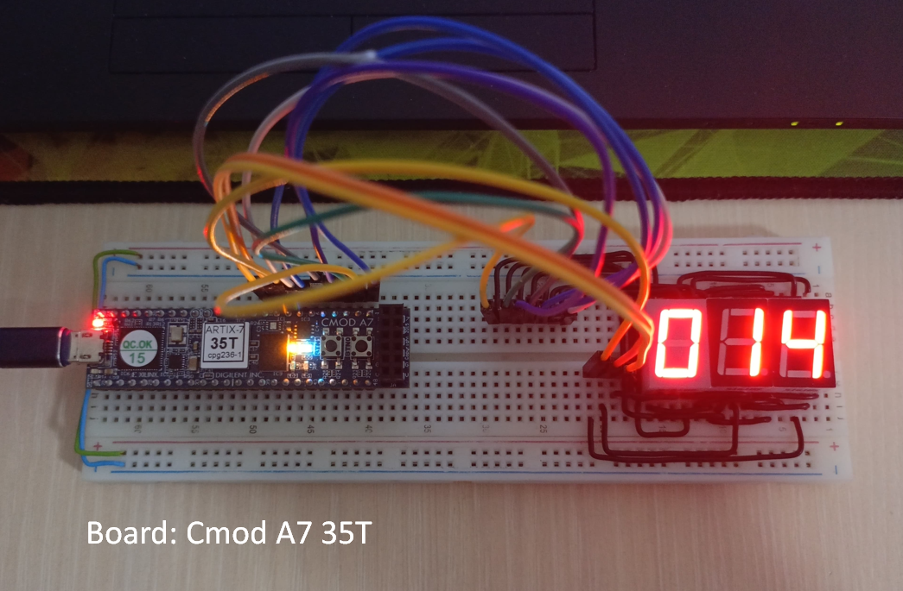
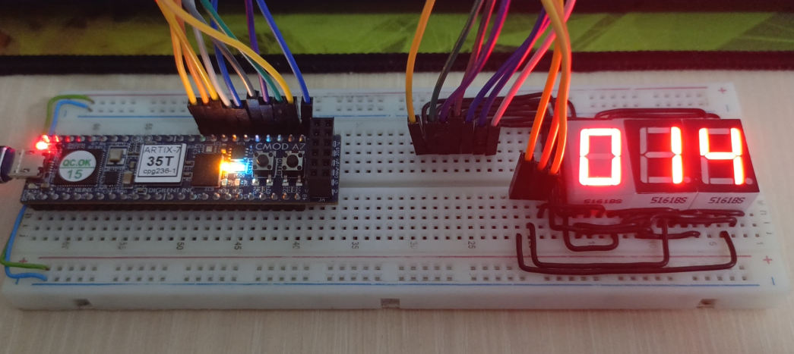

# FPGA Seven Segment Counter

**Basit bir FPGA projesi:** 0'dan 999'a kadar sayan, ortak-anotlu 3 haneli 7 segment display kullanan sayıcı.

## Dosyalar
- Counter.v – Ana modül
- clock_divider.v – 12 MHz → ~60 Hz bölücü (parametrik)

## Özellikler
- **Kart:** Digilent Cmod A7-35T (12 MHz)
- **Buton:** Her basışta sayı 1 artar (999'dan sonra 0’a döner)
- **Reset:** Sıfırlama
- **Multiplexing:** 3 hane sırayla yakılarak gösterilir (~180 Hz)

| Sinyal        | FPGA Pini (Cmod A7) | Açıklama              |
| ------------- | ------------------- | --------------------- |
| `btn`         | A18           | Sayaç artır           |
| `rst`         | B18           | Reset                 |
| `sysclk`      | L17                  | 12 MHz osilatör       |
| `data[6:0]`   | L3-A16-K3-C15-M3-H1-A15 | Seven segment verileri |
| `select[2:0]` | B15-A14-J3              | Segment seçimi           |

  ## Utilization
  

---

https://github.com/user-attachments/assets/3adf131c-9c19-4c6f-86dd-c4036b266b41

## Projeden Öğrendiklerim
- Metastabiliteyi önlemek → 2 kademeli synchronizer ile buton/reset girişlerini senkronize etmek
- Clock kullanımı → 12 MHz sistem saatini clock divider ile ~60 Hz’e indirerek çoklamalı display’i çalıştırmak
